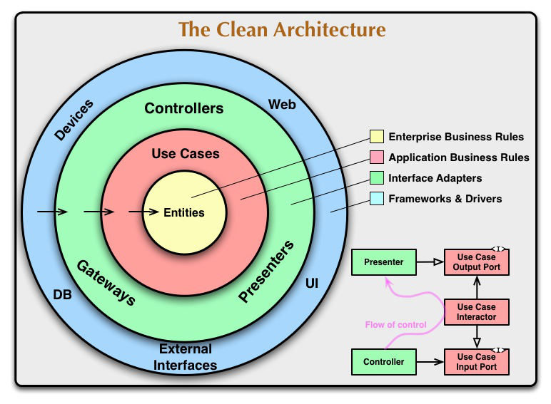

# Clean Architecture React

## Diagrama Arquitetural

Este projeto demonstra como aplicar os princípios da Clean Architecture em uma aplicação React. A Clean Architecture é uma abordagem de design de software que enfatiza a separação de preocupações, promovendo a manutenibilidade, testabilidade e escalabilidade do código.



## Estrutura de pastas

- **domain**: Contém as regras de negócio e lógica da aplicação.
  - **contracts**: Interfaces e contratos usados no domínio.
  - **entities**: Entidades de negócio da aplicação.
  - **usecases**: Casos de uso que orquestram a lógica de negócio.

- **infrastructure**: Implementações concretas de interfaces e detalhes de infraestrutura.
  - **http**: Configurações e implementações de comunicação HTTP.
  - **services**: Serviços de infraestrutura, como APIs externas.

- **main**: Ponto de entrada da aplicação e configuração de dependências.
  - **factories**: Fábricas para criar instâncias de casos de uso, serviços e configurações HTTP.

- **presentation**: Camada de apresentação e lógica de interface com o usuário.
  - **hooks**: Custom hooks utilizados na apresentação.
  - **protocols**: Protocolos e contratos para comunicação na camada de apresentação.
  - **routes**: Definição das rotas da aplicação.

- **ui**: Componentes visuais e layout da aplicação.
  - **atoms**: Componentes básicos e reutilizáveis.
  - **molecules**: Combinações de átomos para formar componentes mais complexos.
  - **organisms**: Componentes ainda mais complexos formados pela combinação de molecules.
  - **templates**: Estruturas de layout que combinam organisms.
  - **pages**: Páginas da aplicação.

## Começando

### Pré-requisitos

- Node.js
- npm ou yarn

### Instalação

Clone o repositório e instale as dependências:

```
git clone https://github.com/maxdickinsondev/react-clean-architecture.git
cd react-clean-architecture
npm install
````
